# 唠唠最近重温加密新的理解（一）

## 前言

随着目前社会的迅速发展和网络的迅速发展，我们生活在这个社会上，说是在这个社会上“裸奔”也没有什么区别了，这时候我们的个人数据安全就尤为的重要（突然就想起了本山大叔的一句话：世界上最痛苦的事情，人活着钱没了！），咳咳，有点跑题了，所以就是说加密这件事情就尤为重要！所以出于好奇心，问了问正在读研的学编码的同学，看看他们最近有没有什么学习到什么东西，我也稍稍的学习学习，于是就产生了这一篇博文。

## 加密方式

### 对称加密

何为对称加密呢？举个例子说明一下，如果我和老王我们密谋去网吧，但是又不想背我老婆知道我们要一起去网吧，但是这个时候老王打电话时候我老婆在旁边，我们该怎么密谋这件事情呢，假设我老婆不会英语，我和老王英语又贼牛逼，这时候我们可以用英语去交流，以下模拟一下这个过程：

```bash
我（内心）：八点走
我（说出来）：eight go cybercafe
老王（接收）：eight go cybercafe
老王（说出来）：oh yeah, best cooperation
```

这时候我就可以给我老婆解释，这个美国的大客户意思是让我现在出去谈一下合作，并且给我说合作愉快，一通瞎解释一番，成功出去嗨皮，但是这个前提条件是我老婆不会英语，如果此时她来一句：together，这时候将是绝杀。这个过程其实就是可以看作，我和老王加密通信，然后我们的密钥就是“英语”，只有一把密钥加密，所以在密码学中称之为对称加密。

通过例子，我们显而易见，密钥一旦被第三人获取了，我们的数据安全就很难得到对应的保障，其实也不见得这种加密方式我们就不可取，因为更加显而易见的事情就是，这种加密方式在解密起来非常的方便。我们之前在上大学时候耳熟能详的就有AES（Advanced Encryption Standard），AES的原理其实也是比较简单，符合对称加密的过程，具体的流程如下：

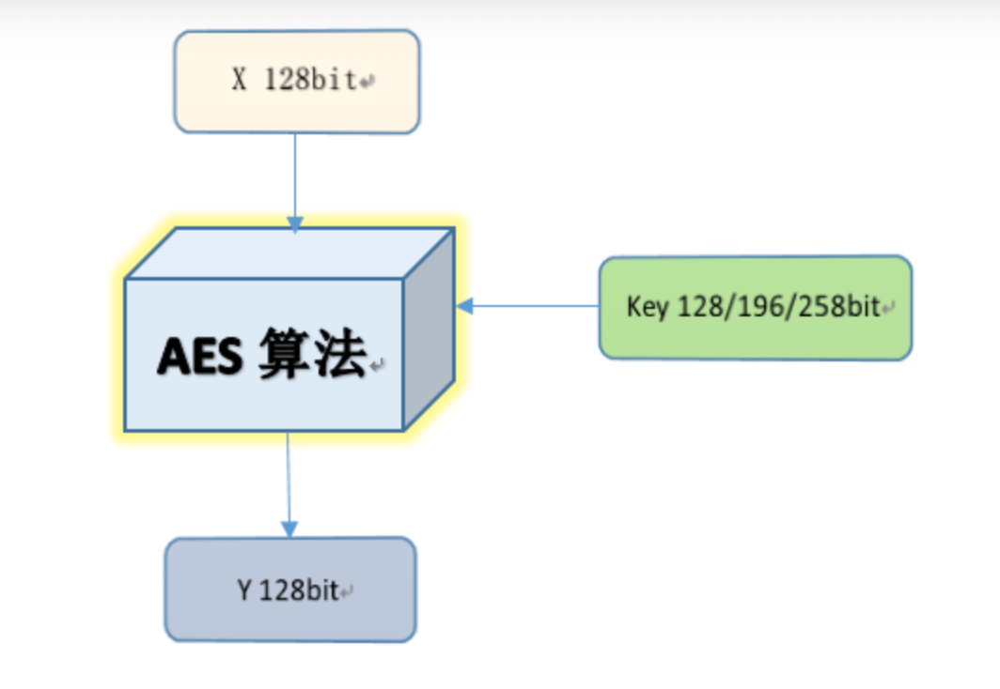

正如图上所说（图上面key后面数字应该是错的，应该为128，192和256），我们加密时候密钥可以是128bit，192bit或者是256bit，当然如果到这里就结束了，作为博客写出来让大家了解显然是比较敷衍的，AES的加密算法这里也简单的说明一下：


从图中很明显的可以看出来我们加密过程中我们除了最后一轮每一轮都需要进行字节代换，行位移和列混合，最后一轮需要进行字节代换和行位移，我们明文加密迭代时候，密钥也需要对应的变化和一直和每一轮的明文变化的结果进行异或。

根据流程图，首先是明文和密钥进行异或得到如下结果：
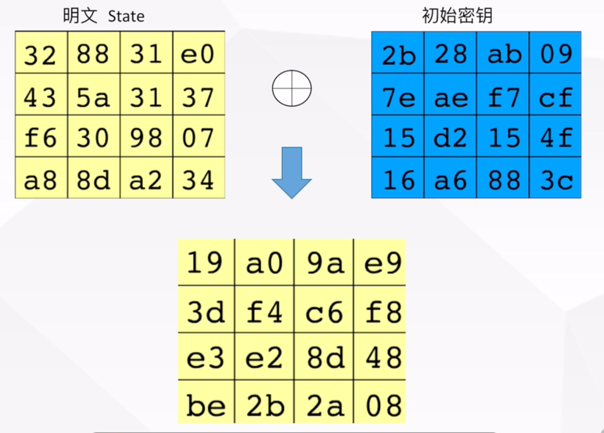

然后就是字节代换部分，简单来说查表，直接看如下的表，查出来的结果应该为 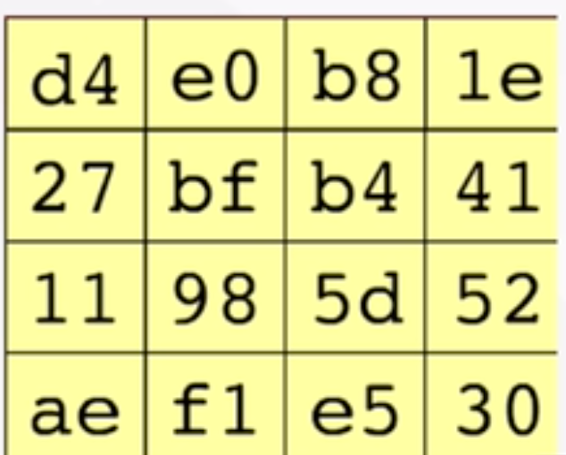：

注：表来自互联网，没有自己画一个，他的行列是16进制的，所以下表中的10-15，我们对应的是a-f
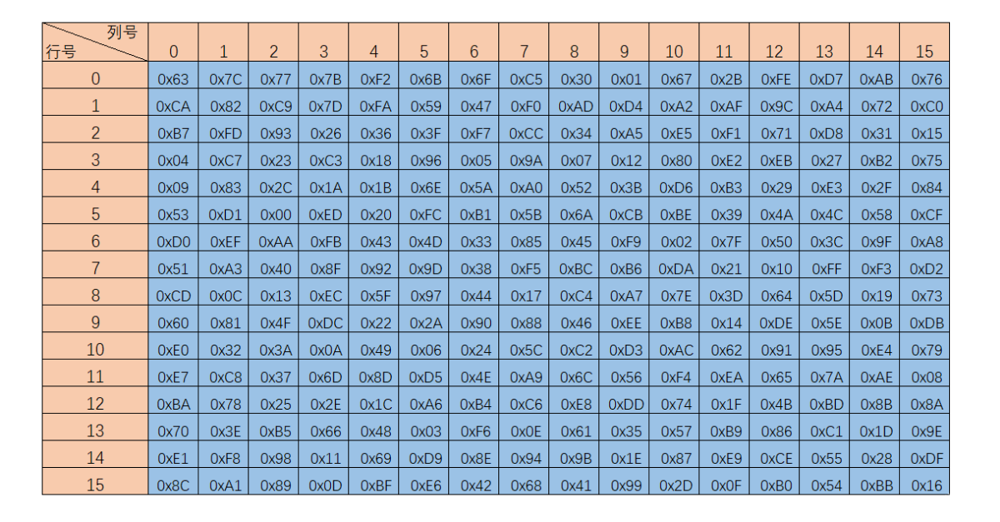

然后就是行位移，简单来说就是第i行左移i，如图：
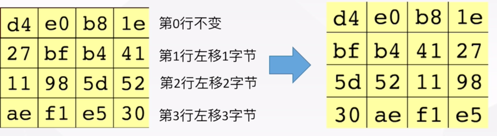

列混合：这里的计算就比较复杂了，简单来说就是需要左乘一个固定的矩阵，如下图：
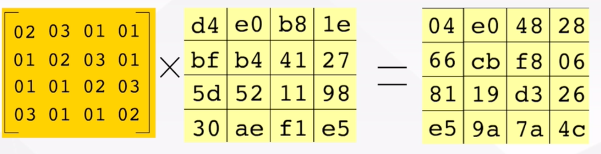

看样子还蛮简单的，但是如果真的挺简单的我也就不会在上面说比较复杂了，细心的朋友们应该已经发现了，这矩阵乘法虽然大家都会，但是这也太复杂了，而且本质上应该是二进制在做，所以在做矩阵乘法时候相乘相加时候肯定也就不是简单的相加了，而是对其进行异或运算，这么多计算的数，想想就头大，所以肯定是有前人总结的规律的，所以我们找到了之后直接使用，公式如下：
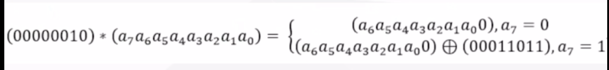

如果需要求03*p，我们将03拆为01异或02，然后乘法分配律去分配出去，之后再求异或即可完成以上操作。

根据流程图，这时候需要和key进行异或了，前面说过我们的key也会迭代，所以我们再来看看密钥是怎么扩展的，这里以key=128bit为例，密钥扩展应该需要遵循如下规定：
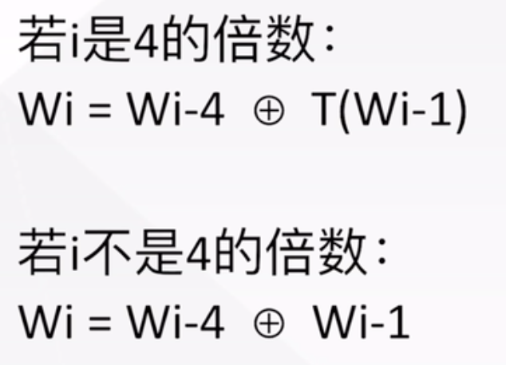

初始密钥矩阵如下，W0表示第0列，密钥的扩展就是要求W4-W7这四列组成的矩阵：
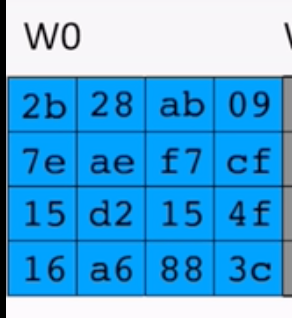

根据定义i不是4的倍数好说直接进行异或运算得到新的列，i如果是4的倍数，那么需要先执行T函数，T函数需要执行的操作为：字循环->字节代换->轮常量异或；字循环也就是那一列直接上移，以计算W4为例，字循环结果就是 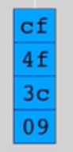，然后需要对其进行字节代换，字节代换我们直接查表，表如上面。

查完表之后对应的这一列应该为 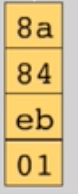，字节代换结束之后就需要进行轮常量异或，这时候每一轮根据底下的表查表就行，以k=128为例，表如下：
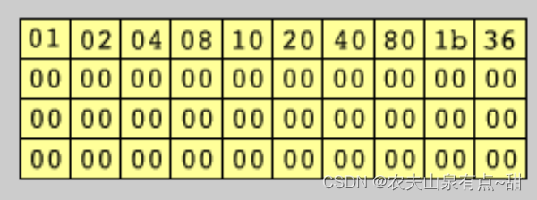

最终的结果为：
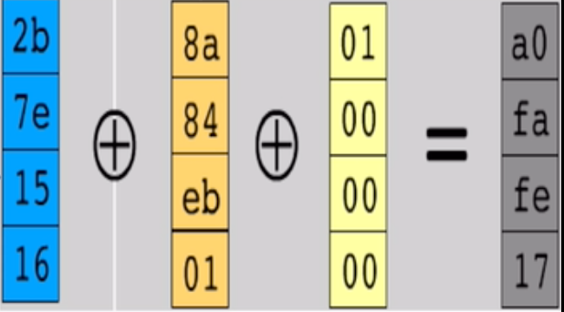

其他列求异或即可得出如下矩阵
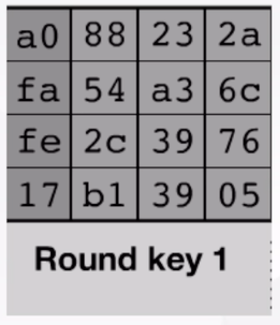

得到了这些之后，我们终于可以开始快乐的重复劳动了，key是128bit时候重复10次即可，到这里，AES加密过程也算说完了，已经看到这里的朋友们应该对对称加密有了一定的了解，这一部分先告一段落。

### 非对称加密

何为非对称加密呢？就直接贴一下看到的博客部分对这个的解释吧：非对称密码提供了一种不需要甲乙二人事先约定共同密钥的加密方法。一组非对称密钥由一个公钥和一个私钥组成，公钥用于加密，私钥用于解密。公钥和私钥是有联系的，但是仅从公钥计算出私钥是非常困难的问题，用公钥加密的数据也不能仅靠公钥解密。这样，甲就可以先生成一组非对称密钥，将公钥发送给乙，乙收到后将要发送的信息以公钥加密发送给甲，甲再用自己的私钥解密。可能有一部分小伙伴对非对称加密不是很熟悉，但是看到这个定义之后应该就熟悉了，也就是我们经常用到的RSA加密算法就是经典的非对称加密。

## 总结

## 参考资料

> https://www.bilibili.com/video/BV1i341187fK

> 《密码编码学与网络安全》
